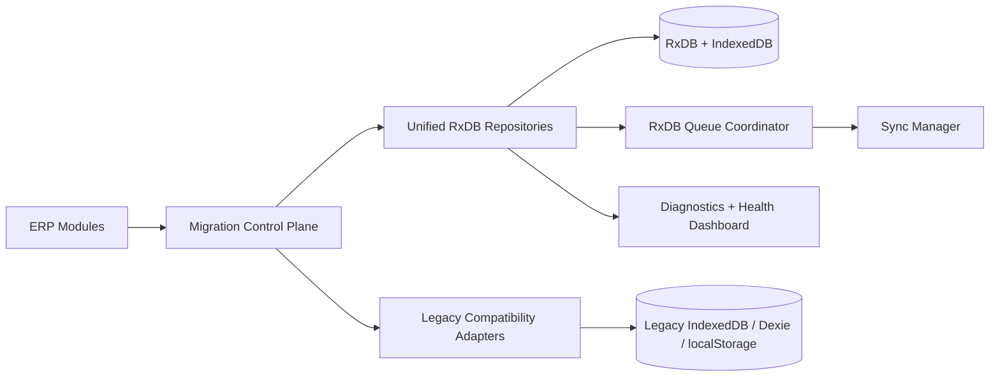
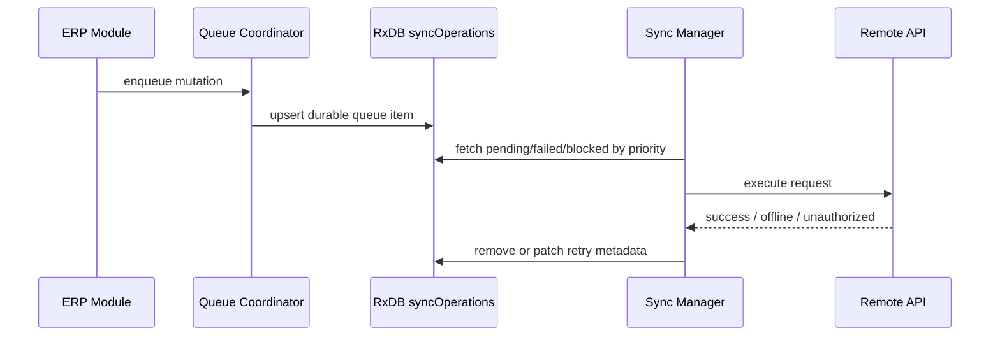
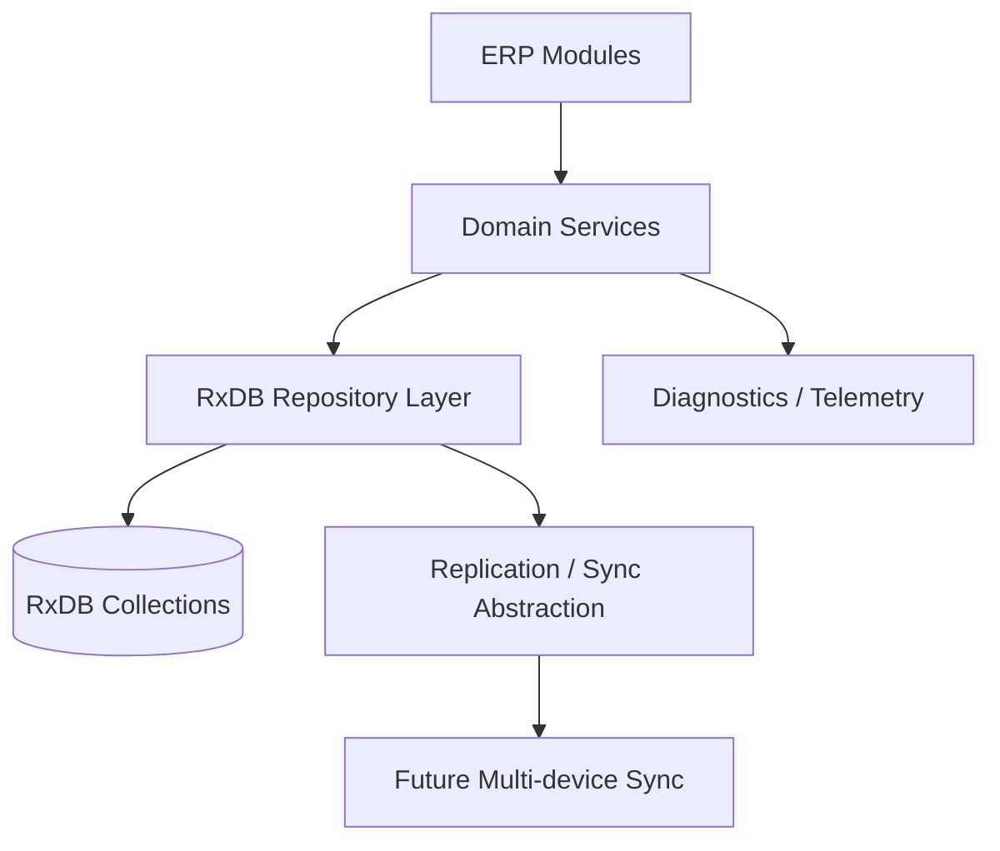

# RxDB Phase 2 Migration Architecture

## Executive Summary

Phase 2 introduces a storage control plane around the existing hybrid ERP runtime instead of attempting a big-bang replacement. The new layer makes RxDB the preferred system of record for safe collections while preserving legacy compatibility through mirrored local storage and IndexedDB bridges where workflows still depend on them.

## Current Hybrid Risk Map

### Remaining legacy dependencies

- `frontend/services/db.ts`
  Still the primary generic IndexedDB gateway for finance, inventory transactions, sales, purchases, invoicing, payroll, banking, and reporting source queries.
- `frontend/services/productionDb.ts`
  Dexie-backed production path for work orders, job tickets, BOMs, resource allocations, and maintenance logs.
- `frontend/services/examinationDb.ts`
  Dexie-backed examination cache that coexists with the RxDB examination pricing collection.
- `frontend/services/offlineDb.ts`
  Legacy offline queue, meta state, and examination batch fallback store.
- `frontend/services/notificationService.ts`
  Previously localStorage-only notification persistence.
- `frontend/services/reportService.ts`
  Previously localStorage-only report definitions, dashboards, schedules, and history.
- `frontend/services/supplierIntegrationService.ts`
  Previously localStorage-only supplier master and purchase-order artifacts.

### Duplicated data flows

- Customers and suppliers exist in both legacy IndexedDB and RxDB collection space.
- Notifications existed in both exam notification stores and localStorage.
- Offline queue state once lived in `offlineDb.syncQueue`, `syncOutbox`, and RxDB `syncOperations`; Phase 2 consolidated everything onto a single durable write path (`durableSyncQueue` → `POST /api/sync/ops`).
- Settings and migration state existed in localStorage, `offlineDb.meta`, and RxDB `settings`.
- Examination pricing data exists across Dexie examination tables, `offlineDb.batches`, and RxDB `examinationPricing`.

### Synchronization and integrity risks

- Queue retries and status changes were not normalized across all persistence paths.
- Legacy fallback logic could silently return stale rows even after RxDB writes succeeded.
- Notification and supplier modules had synchronous local writes with no version discipline.
- Report metadata had no centralized recovery or migration status tracking.
- Repository access patterns were inconsistent: direct `dbService`, Dexie tables, bridge helpers, and localStorage all coexist.

## Phase 2 Architecture

### Control-plane responsibilities

- Central route decisions per collection: `legacy`, `dual-read`, `shadow-write`, `rxdb`
- Feature-flag driven cutover without code rewrites in feature modules
- Persisted migration health and rollback markers
- Collection registry for safe-module sequencing
- Storage usage and collection health snapshots

### Repository responsibilities

- Consistent query options and CRUD behavior
- Serialized write coordination per collection
- Query result memoization for repeated reads
- Pagination helpers for large datasets
- Collection-scoped soft deletion and versioning

### Queue responsibilities

- RxDB-backed durable queue records
- Deduplication by `dedupeKey` and payload match
- Priority-aware processing order
- Retry metadata, attempt history, and next-available timestamps
- Compatibility fallback into legacy queue stores during cutover

## Implemented Phase 2 Components

### New orchestration layer

- `frontend/services/rxdb/migration-control.ts`
  Central registry, feature-route resolution, migration state persistence, cutover and rollback telemetry.

### Unified settings backplane

- `frontend/services/rxdb/settings-backplane.ts`
  Uses RxDB `settings` as primary storage while mirroring to localStorage for legacy compatibility.

### Queue coordinator

- `frontend/services/rxdb/queue-coordinator.ts`
  Adds dedupe, priority ordering, attempt history, and RxDB queue persistence.

### Diagnostics utilities

- `frontend/services/rxdb/diagnostics.ts`
  Collection health reporting, corruption heuristics, queue metrics, and IndexedDB footprint inspection.

### Repository hardening

- `frontend/services/rxdb/repository.ts`
  Adds serialized write locks, query memoization, pagination helpers, and safer count behavior.

### Compatibility refactors

- `frontend/services/offlineDb.ts`
  No longer holds any sync state; it is now only the batches + meta cache.
- `frontend/services/durableSyncQueue.ts` + `frontend/services/backgroundSyncService.ts`
  The single write path (UI → IndexedDB → durable queue → `POST /api/sync/ops`). The legacy `offlineQueueManager` and `syncOutbox` were removed.
- `frontend/services/cloudDb.ts`
  Business writes (e.g. profiles) route through the durable queue; reads, realtime, and file storage stay direct.
- `frontend/services/examinationBatchService.ts`
  Offline batch/class/subject ids are now ULIDs; `enqueueOutbox` writes only to the durable queue.
- `frontend/services/syncManager.ts`
  Now records retry attempts and reuses queue failure patching consistently.
- `frontend/services/notificationService.ts`
  Now hydrates and persists through RxDB notifications while mirroring to localStorage.
- `frontend/services/reportService.ts`
  Now stores report metadata through the settings backplane instead of direct localStorage only.
- `frontend/services/supplierIntegrationService.ts`
  Now persists supplier master data toward RxDB with settings-backed order and quote artifacts.

## Collection Registry for Safe Migration

| Priority | Collection | Default Route | Notes |
| --- | --- | --- | --- |
| 1 | `customers` | `rxdb` | Safe master data cutover |
| 2 | `suppliers` | `shadow-write` | Master in RxDB, order artifacts still bridged |
| 3 | `products` | `dual-read` | Inventory master safe, transaction engine still legacy |
| 4 | `workCenters` | `rxdb` | Production reference data safe |
| 5 | `productionResources` | `rxdb` | Production reference data safe |
| 6 | `manufacturingJobs` | `shadow-write` | Awaiting work-order/job-ticket service consolidation |
| 7 | `examinationPricing` | `dual-read` | Multiple caches still coexist |
| 8 | `notifications` | `rxdb` | Bridged for UI compatibility |
| 9 | `settings` | `rxdb` | Central config and migration state |
| 10 | `auditLogs` | `rxdb` | Safe append-style collection |
| 11 | `syncOperations` | `rxdb` | Durable queue backbone |

## Offline Queue Final Form

Queue policy:

- `urgent`, `high`, `normal`, `low` priorities
- dedupe by semantic key before inserting a duplicate operation
- exponential backoff retained in queue state
- optimistic flags preserved for future background sync UI
- attempt history retained for diagnostics and incident review

## Diagnostics Surface

The new diagnostics utilities support a migration health dashboard with:

- collection route mode
- total and deleted document counts
- corruption heuristics for missing IDs, timestamps, or version metadata
- queue totals by status and priority
- IndexedDB quota and usage metrics
- leader-election visibility for multi-tab behavior

Operator entry points:

- runtime bootstrap: `frontend/services/rxdb/PrimeDatabaseBootstrap.tsx`
- diagnostics route: `/admin/migration-health`
- centralized compatibility seam: `frontend/services/db.ts`

## Performance Strategy

### Implemented now

- repository query memoization for repeated reads
- serialized writes to reduce collection-level race conditions
- queue priority sorting
- settings consolidation to reduce multi-store lookups

### Next recommended slice

- add repository-level indexed query wrappers for high-volume inventory and ledger reads
- replace broad `dbService.getAll()` report fetches with paged repository queries
- move inventory history and supplier order analytics out of localStorage mirrors
- preload only health metadata at startup and lazy-load large collections after first paint

## Rollback Strategy

- Every collection route is feature-switchable via control-plane flags.
- Safe fallback remains available through existing IndexedDB and localStorage mirrors.
- Rollback events are persisted in migration control state for auditability.
- Queue state remains recoverable because RxDB and legacy fallback can both be read during cutover.

## Final-State Target Architecture

Final-state principles:

- RxDB-native repositories as the only browser persistence API
- legacy `dbService`, `productionDb`, `examinationDb`, and direct localStorage removed from domain workflows
- offline queue fully represented as operation logs in `syncOperations`
- deterministic IDs and conflict metadata embedded in repository writes
- diagnostics and recovery workflows treated as first-class runtime features

## Remaining Phase 3 Cutover Checklist

- Replace route-aware `dbService` inventory compatibility reads with direct `products` repository usage in high-volume screens
- Consolidate manufacturing work orders and job tickets under `manufacturingJobs`
- Replace examination Dexie usage with RxDB-backed repositories
- Move report data-source reads off generic `dbService.getAll()` for large datasets
- Remove the leftover `offlineDb.syncQueue` store from existing installs (already removed from the schema); keep `offlineDb.meta` until the migration state is fully on RxDB
- Remove notification localStorage mirror once UI subscribers are fully RxDB-reactive
- Remove supplier local mirrors after procurement UI adopts repository subscriptions
- Add conflict metadata and operation logs to entity writes ahead of replication
